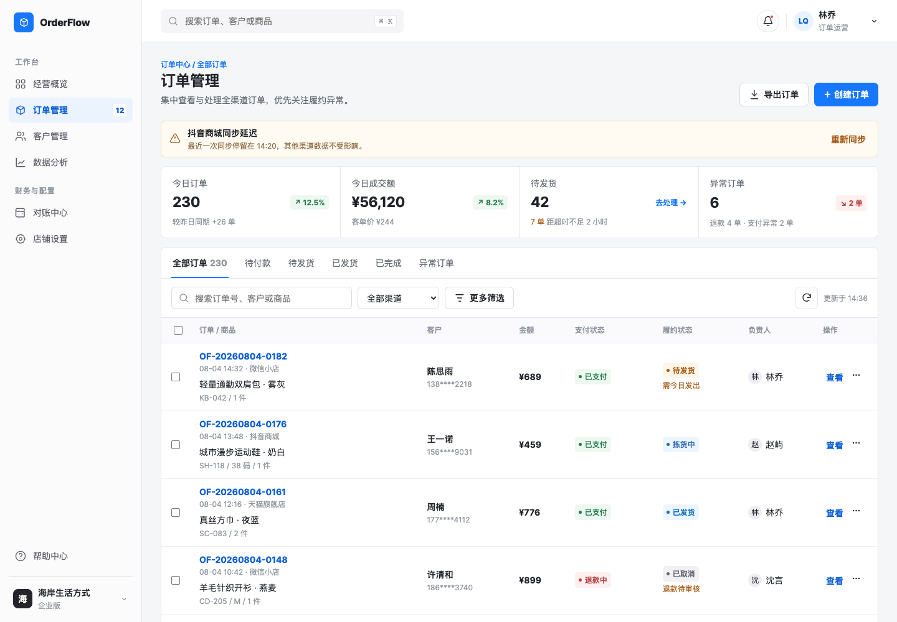
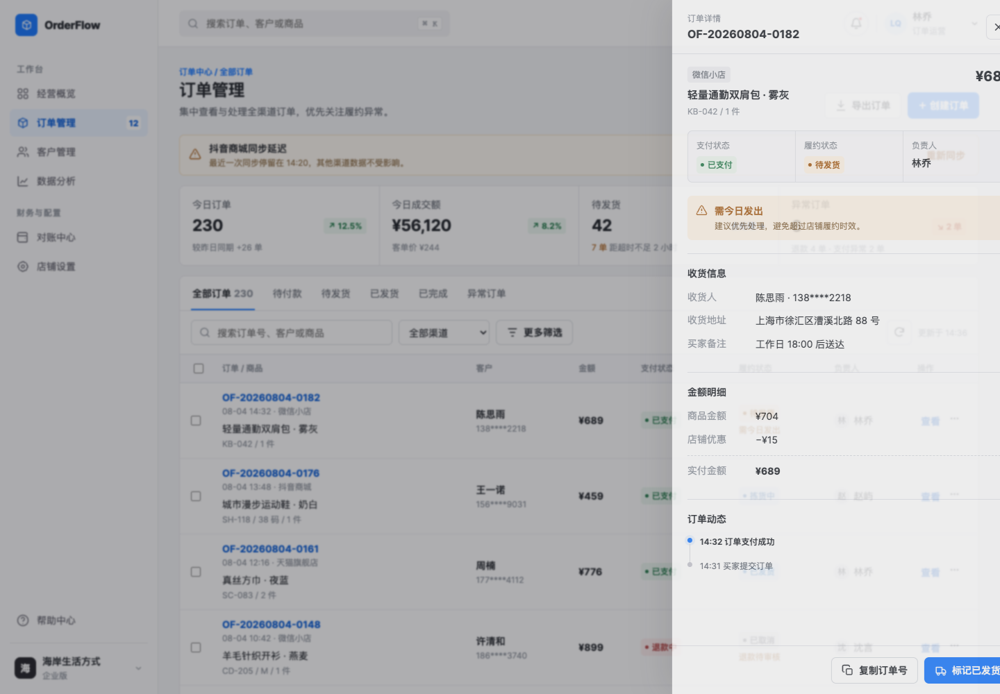
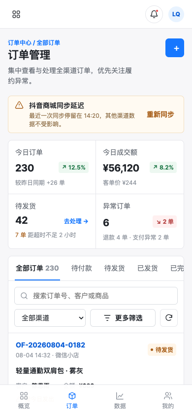
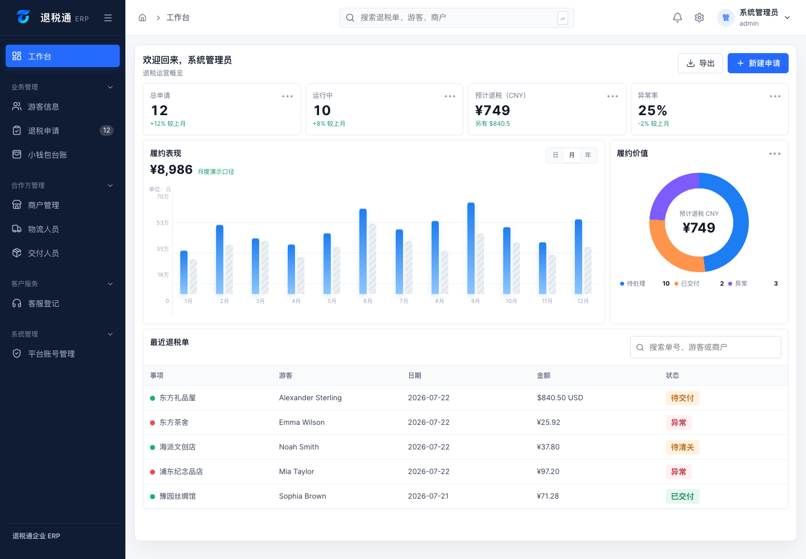
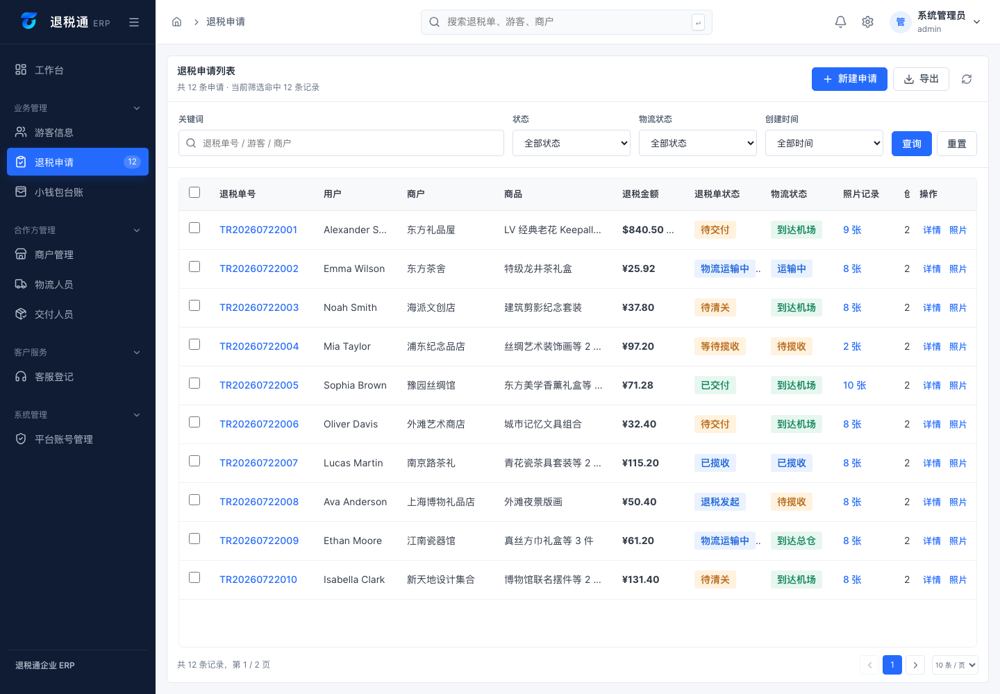
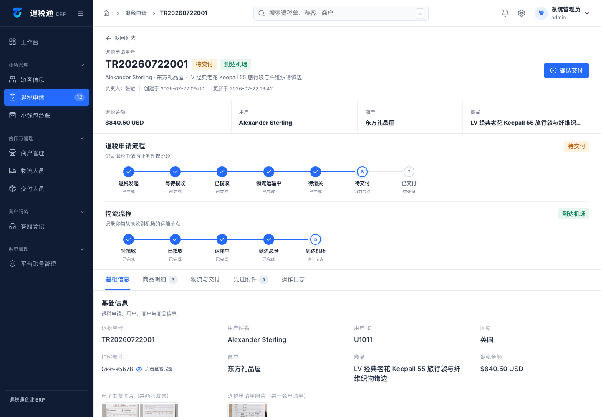

# Idea to Demo

> 把模糊的产品想法，变成一个简洁、可操作、可以验证方向的后台 Demo。

`idea-to-demo` 是一个面向 Codex 和兼容 Agent Skills 标准工具的产品 Demo Skill。它帮助你从一句想法、初步需求、PRD、参考截图或现有前端项目出发，完成需求收敛、页面规划、后台 UI 设计、前端 Demo 实现与基础验证。

它适合 ERP、CRM、订单管理、运营平台、企业工作台、数据看板、列表、详情和表单等场景。目标是尽快做出可运行、可操作、可讨论的前端验证版本，而不是把交互原型包装成生产系统。

## 它会做什么

- 识别主要用户、业务对象和核心任务。
- 把需求压缩成最小但完整的验证路径。
- 规划工作台、列表、详情、表单和关键状态。
- 生成简洁、专业、中高信息密度的后台 UI。
- 使用自洽的 Mock 数据完成主要交互。
- 在代码任务中执行构建、浏览器与响应式检查。
- 明确说明哪些部分是真实实现、模拟行为或生产阶段待办。

一句话：**先做出足够好的 Demo，帮助团队判断方向值不值得继续开发。**

## 一行安装

```bash
npx skills add Goose53-lee/idea-to-demo -g -y
```

安装完成后，使用 `$idea-to-demo` 调用。`-g` 表示全局安装，`-y` 表示跳过确认提示。

## 它不会默认做什么

除非你明确扩大范围，否则它不会把 Demo 描述成包含以下生产能力：

- 真实后端、数据库与持久化；
- 正式登录、RBAC 和数据权限；
- 不可篡改审计、安全与隐私合规；
- 完整自动化测试、性能验证和监控；
- CI/CD、部署与上线验收。

## 示例效果

下面展示同一个 Skill 在不同业务、页面结构和设备宽度下的输出方向。图片使用演示 Mock 数据，重点展示信息层级、状态、交互入口和响应式组织方式。

### OrderFlow：全渠道订单管理

桌面列表把异常提醒、核心指标、筛选和订单处理集中到一条可扫描路径中。



详情使用抽屉保留列表上下文，并把对象身份、履约状态、风险、收货信息、金额和订单动态组织成明确层级。



移动端不缩小桌面表格，而是重组为订单卡片、横向状态导航和底部主导航。

<p align="center">
  
</p>

### 退税通 ERP：工作台、列表与详情

退税通 ERP 案例展示工作台判断、业务列表扫描和对象详情处理三类常见后台结构。

### 工作台：帮助用户先判断，再查看数据



### 列表：保持信息密度与扫描效率



### 详情：明确对象、状态与下一步操作



> 所有图片中的数据均为演示用 Mock 数据，仅用于说明信息层级、数据密度、状态流程与响应式策略。

## 手动安装

### 安装到个人 Skill 目录

把整个 `idea-to-demo` 文件夹复制到：

```text
~/.agents/skills/idea-to-demo
```

安装后可以在不同项目中使用。

### 安装到单个项目

把整个文件夹复制到项目中：

```text
your-project/
└── .agents/
    └── skills/
        └── idea-to-demo/
```

这样 Skill 只服务当前仓库，也可以跟随项目提交给团队。

如果安装后没有立即出现在 Skill 列表中，请重新启动 Codex。

## 基础调用

```text
用 $idea-to-demo，把这个后台想法做成一个可以操作的 Demo。
```

只提供一句想法也可以：

```text
用 $idea-to-demo 做一个门店售后管理后台。
主要给店长使用，他们需要快速发现异常订单并完成处理。
```

有参考图时：

```text
用 $idea-to-demo 分析这些参考图，提取布局和视觉方法，
再结合我的真实需求做一个新的后台 Demo。不要复制原品牌和业务内容。
```

已有代码项目时：

```text
用 $idea-to-demo 改造当前项目的订单列表和详情流程。
先检查现有组件、Token 和运行页面，复用当前技术栈；
完成后检查构建、主要交互、桌面端和窄屏表现。
```

## 工作流程


## Skill 结构

```text
idea-to-demo/
├── SKILL.md
├── README.md
├── LICENSE
├── agents/
│   └── openai.yaml
├── references/
│   ├── discovery-and-scope.md
│   ├── ui-foundations.md
│   ├── page-patterns.md
│   ├── states-responsive-and-content.md
│   └── implementation-and-acceptance.md
└── assets/
    ├── demo-brief.md
    ├── demo-handoff.md
    ├── order-management-desktop.png
    ├── order-management-detail.png
    ├── order-management-mobile.png
    ├── erp-dashboard.png
    ├── erp-refund-list.png
    └── erp-refund-detail.png
```

`SKILL.md` 只保留核心工作流。详细规则按任务需要从 `references/` 加载，避免一次把整份设计规范塞进上下文。

## 适合的任务

- ERP、CRM、运营平台和管理后台；
- 企业工作台、任务中心和数据看板；
- 列表、详情、表单、审批和异常处理流程；
- 从 PRD 或参考图快速形成交互 Demo；
- 对现有前端进行前期方案重构和验证。

它不适合替代正式的后端架构、安全评审、数据库设计、生产测试或上线流程。

## License

[MIT](LICENSE)
