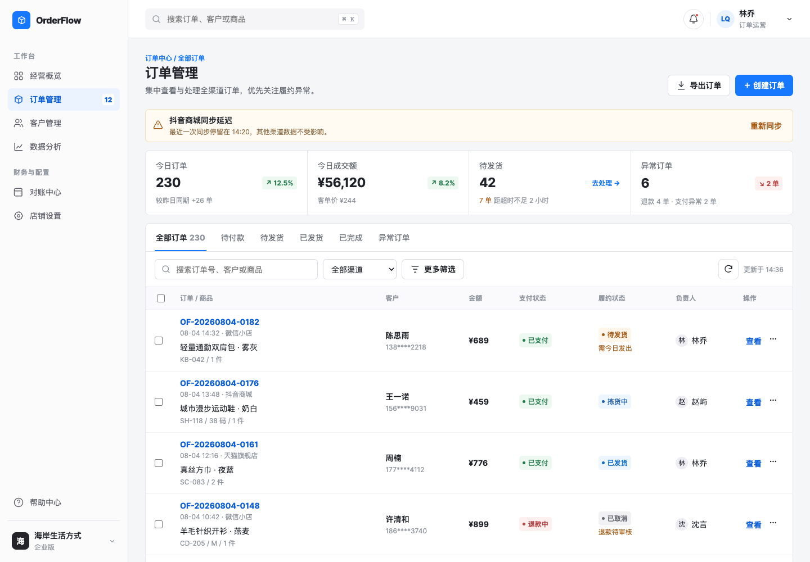
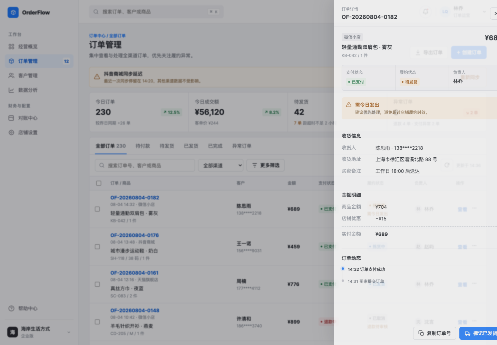
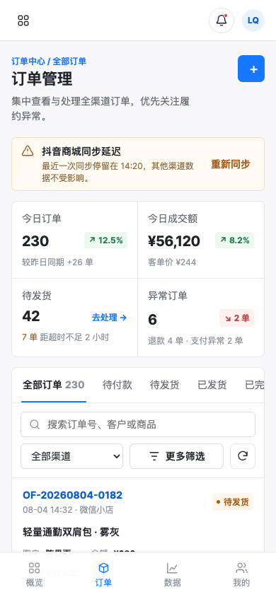
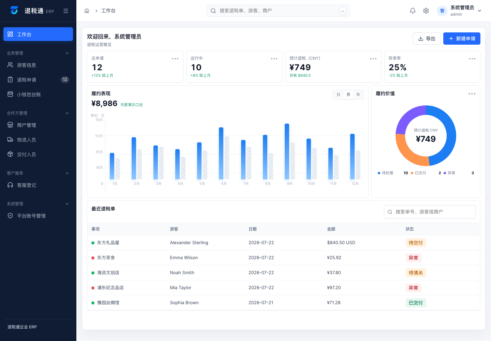
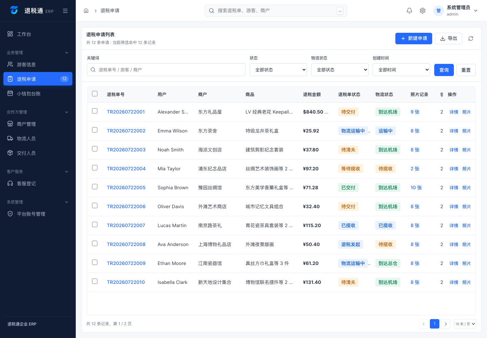
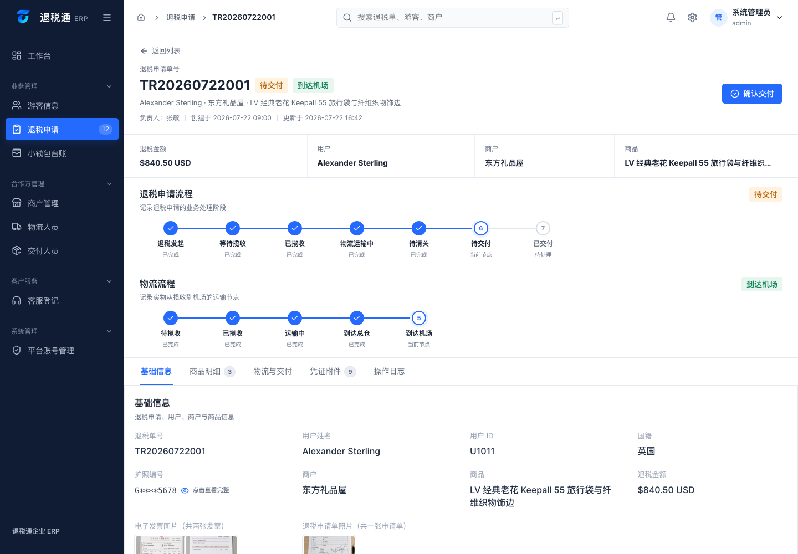

# Idea to Demo

> 把一个还没想清楚的想法，做成能点击、能比较、能做决定的 Demo。

`idea-to-demo` 先判断你要验证的是组件选择、局部模式，还是一条完整流程。

- 组件选择：做一个小型对比沙盒，回答“哪个方向更合适”。
- 完整流程：做一条从入口到结果的最小路径，回答“用户能不能完成这件事”。
- 现有项目：沿用当前技术栈、组件和 Token，在真实代码里验证改动。

它不为了显得完整而补产品外壳。组件验证保持局部，流程验证才建立用户、业务对象和 Mock 数据。移动端看板从手机首屏开始设计，不把桌面看板缩小后直接塞进手机。



## 快速开始

安装：

```bash
npx skills add Goose53-lee/idea-to-demo -g -y
```

调用：

```text
用 $idea-to-demo，把这份需求做成一个可以操作的后台 Demo。
```

一句话也够：

```text
用 $idea-to-demo 做一个门店售后管理后台。
主要给店长使用，他们需要快速发现异常订单并完成处理。
```

## 工作方式

### 1. 写清要验证的事

先确定验证模式、目标视口、受众和判断标准。组件问题只保留会影响选择的上下文；流程问题才继续梳理主要用户、业务对象和下一步动作。

### 2. 选最小的验证单元

流程 Demo 通常包含概览、列表或队列、详情，以及一次有意义的处理动作。组件 Demo 只保留两到四个受控变体和必要状态，不补无关页面。

### 3. 实现影响判断的交互

代码 Demo 使用连贯的 Mock 数据和真实的本地交互。搜索、筛选、抽屉、表单、反馈、空状态和错误状态，只在它们会改变判断时加入。静态截图不能代替主路径。

### 4. 在浏览器里检查结果

交付前会检查构建、主流程、桌面端、窄屏和任务范围内的状态。完成报告会写明哪些是真的、哪些是模拟的、哪些仍留给生产开发。

## 组件验证

组件验证适合测试表格、卡片、筛选器、标签、状态、空状态、排版、间距和局部交互。

你会得到：

- 两到四个受控变体；
- 默认、选中、禁用、加载、空值、长内容或窄屏等必要状态；
- 一份对比结论、取舍和仍未解决的问题。

这类任务不会强制引入完整组件库。只有当库本身就是被验证的对象，或新建 Demo 确实需要组件基础时，才会引入依赖。

## 默认技术栈

新建的流程 Demo 没有指定技术栈时，默认使用：

- shadcn/ui
- Base UI
- Tailwind CSS
- Lucide icons

依赖安装在 Demo 项目本地。已有项目继续使用自己的包管理器、锁文件和组件。

## 适合用来验证

- ERP、CRM、订单管理、运营平台和企业工作台；
- 列表、详情、表单、审批和异常处理流程；
- 表格、卡片、筛选器、状态和响应式布局；
- 从一句想法、PRD 或参考图快速判断产品方向；
- 在已有前端项目中补出一条可评审的流程。

如果问题的核心是后端架构、数据库、安全、权限、部署或生产验收，这个 Skill 只能负责前端验证。

## 示例

### OrderFlow：列表、详情与移动端

桌面列表把异常提醒、指标、筛选和订单处理放在同一条路径里。

详情用抽屉保留列表上下文，让用户查看状态、风险、收货信息、金额和订单动态后继续处理。



窄屏改用订单卡片和移动导航，不压缩桌面表格。

<p align="center">
  
</p>

### 退税通 ERP：工作台、列表与详情

工作台先给判断，再让用户进入数据。



列表保留扫描效率和关键操作。



详情把对象、状态和下一步动作放在一起。



> 示例使用 Mock 数据，只展示信息结构、状态关系、交互路径和响应式处理。

## 调用示例

有 PRD：

```text
用 $idea-to-demo 阅读这份 PRD。
先确定主要用户和最值得验证的路径，再做一个可运行的后台 Demo。
```

有参考图：

```text
用 $idea-to-demo 提取这些参考图的布局、层级和交互方法，
结合我的业务重新设计。不要复制原品牌和业务内容。
```

已有项目：

```text
用 $idea-to-demo 改造当前项目的订单列表和详情流程。
先检查现有组件、Token 和运行页面，复用当前技术栈；
完成后检查构建、主流程、桌面端和窄屏。
```

## 安装到其他位置

个人安装：把仓库复制到 `~/.agents/skills/idea-to-demo`。

项目安装：把 Skill 放进项目的 `.agents/skills/idea-to-demo/`，它只服务当前仓库，也可以跟随项目提交给团队。

安装后没有出现在 Skill 列表中时，请重新启动 Codex。

## 仓库结构

```text
idea-to-demo/
├── SKILL.md
├── agents/
│   └── openai.yaml
├── references/
│   ├── discovery-and-scope.md
│   ├── component-validation.md
│   ├── component-stack.md
│   ├── ui-foundations.md
│   ├── page-patterns.md
│   ├── mobile-dashboard-patterns.md
│   ├── states-responsive-and-content.md
│   └── implementation-and-acceptance.md
└── assets/
    ├── demo-brief.md
    ├── demo-handoff.md
    └── example screenshots
```

`SKILL.md` 保存核心流程。页面模式、视觉基础、状态、响应式和验收规则按任务需要从 `references/` 读取。

## License

[MIT](LICENSE)
